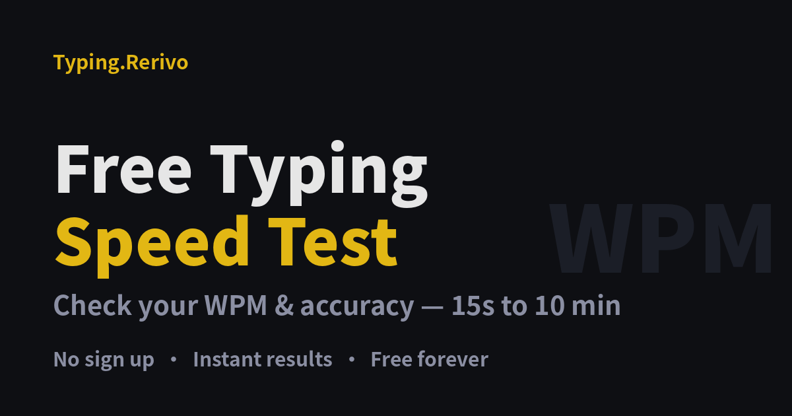

# Typing.Rerivo

**A free online typing test — 20 timed variants, no signup, no ads.**

🔗 Live: **<https://typing.rerivo.com>**



Instant WPM and accuracy, runs entirely in your browser, and your results are
saved locally. Built as a multilingual typing-practice playground.

## Why

Most typing tests force you to sign up, shove ads into the practice area, or
only offer a single 1-minute round. Typing.Rerivo is the opposite: open the
page, pick a duration, start typing.

## Features

- **20 landing pages** covering the full duration ladder and practice variants
  ([30 second](https://typing.rerivo.com/30-second-typing-test.html) ·
  [1 minute](https://typing.rerivo.com/1-minute-typing-test.html) ·
  [3 minute](https://typing.rerivo.com/3-minute-typing-test.html) ·
  [5 minute](https://typing.rerivo.com/5-minute-typing-test.html) ·
  [10 minute](https://typing.rerivo.com/10-minute-typing-test.html) ·
  [numbers](https://typing.rerivo.com/number-typing-test.html) ·
  [punctuation](https://typing.rerivo.com/punctuation-typing-test.html) ·
  [typing practice](https://typing.rerivo.com/typing-practice.html) …)
- **Timed rounds from 15s to 10min** with 4 text modes: sentences, quotes, numbers, words
- **Instant WPM + accuracy**, results stored in `localStorage`, unlimited retakes
- **Multilingual practice pools** — English, Chinese, Spanish, Hindi, Arabic
- **Installable PWA** (works offline once loaded)
- **Zero backend** — 100% static, no account, no tracking, no ads

## How it's built

One template + one config table generate the whole site — every page is a
build artifact, never hand-edited.

- **Vanilla JS + HTML/CSS**, no framework, no build toolchain beyond Python
- `src/template.html` + `src/pages.json` → `build.py` renders all 20 pages
- **SEO built-in**: JSON-LD (`WebApplication` / `FAQPage` / `BreadcrumbList`)
  on every page, plus `sitemap.xml`, `robots.txt`, `llms.txt`
- **Regression guard**: `verify.py` (13/13 structural checks) + an engine
  behavior harness keep the generated pages honest

## Local development

```bash
python3 build.py      # render all pages from src/
python3 verify.py     # run the 13/13 regression checks
python3 -m http.server 8000   # then open http://localhost:8000
```

Requires only Python 3 (the static generator). No `npm install`.

## Deploy

```bash
git push origin main   # → GitHub Pages (CNAME: typing.rerivo.com)
```

Pushing to `main` auto-deploys. Don't hand-edit files in the repo root —
change `src/`, re-run `build.py`, then commit the regenerated pages.

## Repo layout

```
src/            template, pages.json, engine.js, ui.js, footer.html, style.css
src/pools/      practice content (en / zh / es / hi / ar)
tools/          generator & extraction helpers
*.html          generated pages (build artifacts)
og-cover.png    social preview image
```

## Links

- Live site — <https://typing.rerivo.com>
- 30-second quick test — <https://typing.rerivo.com/30-second-typing-test.html>
- Practice — <https://typing.rerivo.com/typing-practice.html>

---

Feedback and PRs welcome.
